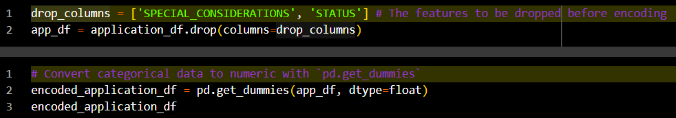
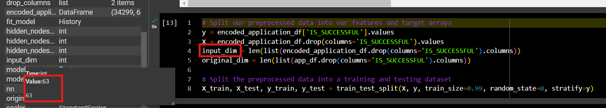
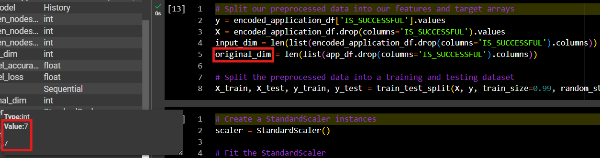
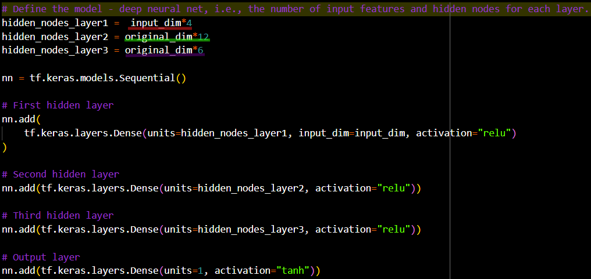
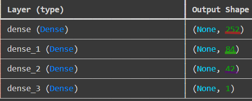

# Deep Learning Challenge

## Overview of the Analysis

- The purpose this analysis is to build, train, and test a binary classifier that can predict whether applicants will be successful in their ventures if funded by the nonprofit foundation Alphabet Soup.
- A CSV file containing the dataset of more than 34,000 organizations that have received funding from Alphabet Soup over the years was provided to train and test the binary classifier.
- The dataset has the following features:
  - **EIN and NAME**—Identification columns.
  - **APPLICATION_TYPE**—Alphabet Soup application type.
  - **AFFILIATION**—Affiliated sector of industry.
  - **CLASSIFICATION**—Government organization classification.
  - **USE_CASE**—Use case for funding.
  - **ORGANIZATION**—Organization type.
  - **STATUS**—Active status.
  - **INCOME_AMT**—Income classification.
  - **SPECIAL_CONSIDERATIONS**—Special considerations for application.
  - **ASK_AMT**—Funding amount requested.
  - **IS_SUCCESSFUL**—Was the money used effectively.
- The binary classifier was built, trained, and tested in the following manner:
  - **Step 1: Preprocess the Data**.
    - Read in the `charity_data.csv` to a Pandas DataFrame.
    - Drop the **EIN** and **NAME** columns.
    - Determine the number of unique values for each column.
    - For columns that have more than 10 unique values, determine the number of data points for each unique value.
    - Use the number of data points for each unique value to pick a cutoff point to combine "rare" categorical variables together in a new value, Other, and then check if the replacement was successful.
    - Use `pd.get_dummies()` to encode categorical variables.
    - Split the preprocessed data into a features array, X, and a target array, y; use these arrays and the train_test_split function to split the data into training and testing datasets.
    - Scale the training and testing features datasets by creating a StandardScaler instance, fitting it to the training data, then using the transform function.
  - **Step 2: Compile, Train, and Evaluate the Model**.
    - Create a neural network model by assigning the number of input features and nodes for each layer using TensorFlow and Keras.
    - Create the first hidden layer and choose an appropriate activation function.
    - If necessary, add a second hidden layer with an appropriate activation function.
    - Create an output layer with an appropriate activation function.
    - Check the structure of the model.
    - Compile and train the model.
    - Create a callback that saves the model's weights every five epochs.
    - Evaluate the model using the test data to determine the loss and accuracy.
    - Save and export the results to an HDF5 file, named `AlphabetSoupCharity.h5`.
  - **Step 3: Optimize the Model**.
    - Create a new Google Colab file and name it `AlphabetSoupCharity_Optimization.ipynb`.
    - Import the dependencies and read in the `charity_data.csv` to a Pandas DataFrame.
    - Preprocess the dataset as it was done in Step 1—be sure to adjust for any modifications that came out of optimizing the model.
    - Design a neural network model, and adjust for modifications that will optimize the model to achieve higher than 75% accuracy.
    - Save and export the results to an HDF5 file, named `AlphabetSoupCharity_Optimization.h5`.

---

## Results

**Data Preprocessing:**

- What variable is the target for your model?
  - **IS_SUCCESSFUL**—Was the money used effectively.
- What variables are the features for your model?
  - **APPLICATION_TYPE**—Alphabet Soup application type.
  - **AFFILIATION**—Affiliated sector of industry.
  - **CLASSIFICATION**—Government organization classification.
  - **USE_CASE**—Use case for funding.
  - **ORGANIZATION**—Organization type.
  - **INCOME_AMT**—Income classification.
  - **ASK_AMT**—Funding amount requested.
- What variables should be removed from the input data because they are neither targets nor features?
  - **STATUS**—Active status.
  - **SPECIAL_CONSIDERATIONS**—Special considerations for application.

**Compiling, Training, and Evaluating the Model:**

- How many neurons, layers, and activation functions did you select for your neural network model, and why?
  - I selected the number of neurons and layers that I did and the activation functions for each layer that I did for my neural network model, because these numbers of neurons and layers and types of activation functions seemed to consistently provide higher accuracy ratings during the optimization process.
  - The exact values are shown in the following images:
  
  
  
  
  

- Were you able to achieve the target model performance?
  - Yes, I managed to achieve an accuracy around 75.2% on optimization step/attempt 72, however, in the subsquent steps taken to achieve an even higher accuracy rating I was unable to achieve an accuracy higher than 75%—which was the target model performance.
- What steps did you take in your attempts to increase model performance?

Optimization steps/attempts:

1. Increase 2nd hidden layers nodes from 18 to 36;
results: Loss: 0.5599457621574402, Accuracy: 0.7285131216049194

2. Changing output layer activation function from sigmoid to tanh
results: Loss: 0.5922526717185974, Accuracy: 0.7293294668197632

3. Changing the activation functions of the other layers from relu to tanh
results: Loss: 0.5740083456039429, Accuracy: 0.728396475315094

4. Changed 1st hidden layer nodes to the number of input dimensions, i.e., 43, and the 2nd hidden layer nodes to twice that of the 1st
results: Loss: 0.5805881023406982, Accuracy: 0.7273469567298889

5. Doubled the 1st and 2nd hidden layer nodes
Loss: 0.605830192565918, Accuracy: 0.718367338180542

6. Revert the hidden layer nodes to the amounts in step 3, and change the cutoff points for the APPLICATION_TYPE and CLASSIFICATION features so that each has only four categories.
Loss: 0.5800977349281311, Accuracy: 0.7230320572853088

7. Double training regimen epochs.
Loss: 0.5882750749588013, Accuracy: 0.7227988243103027

8. Reduce training regimen epochs by half, and drop the APPLICATION_TYPE and CLASSIFICATION features.
Loss: 0.6202854514122009, Accuracy: 0.698309063911438

9. Keep APPLICATION_TYPE and drop CLASSIFICATION only.
Loss: 0.6026695966720581, Accuracy: 0.7097375988960266

10. Keep APPLICATION_TYPE unmodified and drop CLASSIFICATION only.
0.5896937251091003, Accuracy: 0.7222157716751099

11. Keep CLASSIFICATION and drop APPLICATION_TYPE only.
0.5951144695281982, Accuracy: 0.7076385021209717

12. Keep CLASSIFICATION unmodified and drop APPLICATION_TYPE only.
Loss: 0.6004459857940674, Accuracy: 0.711953341960907

13. Keep both APPLICATION_TYPE and CLASSIFICATION unmodified.
Loss: 0.5854231119155884, Accuracy: 0.7306122183799744

14. Keep APPLICATION_TYPE unmodified and modify CLASSIFICATION to have fewer categories but not as few as before.
Loss: 0.5891750454902649, Accuracy: 0.7292128205299377

15. Double the 2nd hidden layer nodes
Loss: 0.5725356936454773, Accuracy: 0.7295626997947693

16. Double the 2nd hidden layer nodes again.
Loss: 0.5955641269683838, Accuracy: 0.7300291657447815

17. Double the 2nd hidden layer nodes again. Now it is 8 times the number of features in the data.
Loss: 0.5866553783416748, Accuracy: 0.7297959327697754

18. Double the 1st hidden layer nodes. It will now be 4 times the number of features in the encoded data.
Loss: 0.6002277135848999, Accuracy: 0.726064145565033

19. Lower the 2nd hidden layer nodes down to 6 times the number of features in the data.
Loss: 0.5779463648796082, Accuracy: 0.7300291657447815

20. Before encoding the data, change the values in the SPECIAL_CONSIDERATIONS feature from Y to 1 and N to 0.
Loss: 0.575359582901001, Accuracy: 0.7257142663002014

21. Drop the SPECIAL_CONSIDERATIONS feature.
Loss: 0.5849562287330627, Accuracy: 0.7290962338447571

22. Double the 1st hidden layer nodes. It will now be 6 times the number of features in the encoded data.
Forgot to type out the `model_loss` and `model_accuracy` rates.

23. Reduce the 1st hidden layer nodes to 4 times the number of features in the encoded data, and drop the STATUS feature.
Loss: 0.5796859264373779, Accuracy: 0.7301457524299622

24. Drop the 'AFFILIATION' feature.
Loss: 0.6286032199859619, Accuracy: 0.6535276770591736

25. Keep the 'AFFILIATION' feature, and drop ORGANIZATION
Loss: 0.5771600008010864, Accuracy: 0.7243148684501648

26. Keep the ORGANIZATION feature, and drop USE_CASE
Loss: 0.5662335157394409, Accuracy: 0.7274635434150696

27. Keep USE_CASE feature, and drop INCOME_AMT.
Loss: 0.5660638213157654, Accuracy: 0.7297959327697754

28. Keep INCOME_AMT.
Loss: 0.5662772059440613, Accuracy: 0.7310787439346313

29. Double the number of epochs.
Loss: 0.5762221217155457, Accuracy: 0.7227988243103027

30. Revert epochs to 100, and change 1st hidden layer activation function to relu.
Loss: 0.6096909046173096, Accuracy: 0.7252478003501892

31. change 2nd hidden layer activation function to relu.
Loss: 0.5922614932060242, Accuracy: 0.7266472578048706

32. change output layer activation function to relu.
Loss: 0.5814189910888672, Accuracy: 0.7309620976448059

33. Double the number of epochs.
Loss: 0.6000269055366516, Accuracy: 0.7259474992752075

34. Lower the epochs to 50.
Loss: 0.7207641005516052, Accuracy: 0.7251312136650085

35. increase epochs to 75.
Loss: 0.6205423474311829, Accuracy: 0.7290962338447571

36. increase epochs to 150.
Loss: 0.6385608911514282, Accuracy: 0.724781334400177

37. lower epochs back to 100, and change output activation function to tanh.
Loss: 0.648751437664032, Accuracy: 0.7225655913352966

38. change the other layer activation functions to tanh.
Loss: 0.5853482484817505, Accuracy: 0.7306122183799744

39. Drop the 'ASK_AMT' feature.
Loss: 0.5716167688369751, Accuracy: 0.7278134226799011

40. Keep the 'ASK_AMT' feature.
Loss: 0.5933842658996582, Accuracy: 0.7258309125900269

41. Change the activation functions of the non-output layers to relu.
Loss: 0.6080901026725769, Accuracy: 0.7309620976448059

42. Increase the number of 2nd hidden layer nodes to 8 times the number of features in the data before encoding.
Loss: 0.6256362795829773, Accuracy: 0.7307288646697998

43. Increase the number of 1st hidden layer nodes to 6 times the number of features in the encoded data.
Loss: 0.6054263114929199, Accuracy: 0.7237317562103271

44. Increase the number of 2nd hidden layer nodes to 10 times the number of features in the data before encoding.
Loss: 0.5863826870918274, Accuracy: 0.728863000869751

45. Lower the 1st hidden layer nodes to 4 times the number of features in the encoded data.
Loss: 0.5982242822647095, Accuracy: 0.7323614954948425

46. Lower the 1st hidden layer nodes to 2 times the number of features in the encoded data.
Loss: 0.6102522611618042, Accuracy: 0.7304956316947937

47. Change the 1st hidden layer nodes back to 4 times the number of features in the encoded data.
Loss: 0.6002065539360046, Accuracy: 0.731195330619812

48. Add a third hidden layer with the number of nodes being 4 times the number of features in the data before encoding.
Loss: 0.5976084470748901, Accuracy: 0.7307288646697998

49. Change the 3rd hidden layer nodes to 10 times the number of features in the data before encoding.
Loss: 0.6373642086982727, Accuracy: 0.7308454513549805

50. Change the 1st hidden layer nodes to 2 times the number of features in the encoded data, and the 2nd to 4 times the number of features in the encoded data.
Loss: 0.632061779499054, Accuracy: 0.7276967763900757

51. Change the 1st hidden layer nodes to 4 times the number of features in the encoded data
Loss: 0.6042165756225586, Accuracy: 0.7292128205299377

52. Change the 2nd hidden layer to 6 times the number of features in the encoded data.
Loss: 0.6628953814506531, Accuracy: 0.7279300093650818

53. Change the 2nd layer activation function to tanh.
Loss: 0.6007153987884521, Accuracy: 0.7306122183799744

54. Add a fourth hidden layer with the number of nodes being 4 times the number of features in the data before encoding and activation function being tanh.
Loss: 0.5618118643760681, Accuracy: 0.7251312136650085

55. Change the size of the train data to 90%.
Loss: 0.5598112940788269, Accuracy: 0.7332361340522766

56. Remove the fourth hidden layer.
Loss: 0.6860365867614746, Accuracy: 0.7335277199745178

57. Remove the second hidden layer.
Loss: 0.6016715168952942, Accuracy: 0.7332361340522766

58. Change the third, now the second, hidden layer activation function from relu to the sigmoid.
Loss: 8.580655097961426, Accuracy: 0.4676384925842285

59. Change the 1st hidden layer activation function from relu to the sigmoid.
Loss: 8.580655097961426, Accuracy: 0.4676384925842285

60. Change the hidden layers' activation functions from sigmoid to tanh.
Loss: 0.5805067420005798, Accuracy: 0.7323614954948425

61. Increase the third, now the second, hidden layer nodes from 10 to 12 times the number of features in the data before encoding.
Loss: 0.6465280652046204, Accuracy: 0.7294460535049438

62. Decrease the third, now the second, hidden layer nodes from 12 to 10 times the number of features in the data before encoding, and change its activation function from tanh to relu.
Loss: 0.6237941980361938, Accuracy: 0.731195330619812

63. Change the size of the train data to 95%.
Loss: 0.5480509996414185, Accuracy: 0.7422740459442139

64. Increase the third, now the second, hidden layer nodes from 10 to 12 times the number of features in the data before encoding.
Loss: 0.5533501505851746, Accuracy: 0.7457726001739502

65. Change the 1st hidden layer nodes to 6 times the number of features in the encoded data.
Loss: 0.5736596584320068, Accuracy: 0.744023323059082

66. Change the 1st hidden layer nodes from 6 to 4 times the number of features in the encoded data, and change the third, now the second, hidden layer nodes from 12 to 14 times the number of features in the data before encoding.
Loss: 0.5968521237373352, Accuracy: 0.7469387650489807

67. Change the third, now the second, hidden layer nodes from 14 to 16 times the number of features in the data before encoding.
Loss: 0.5740073323249817, Accuracy: 0.7446064352989197

68. Change the third, now the second, hidden layer activation function from relu to tanh.
Loss: 0.5415208339691162, Accuracy: 0.7486880421638489

69. Add a third hidden layer again with tanh activation function and the number of nodes being 4 times the number of features in the data before encoding.
Loss: 0.5460748076438904, Accuracy: 0.7446064352989197

70. Change the 3rd layer activation function from tanh to relu.
Loss: 0.5595412850379944, Accuracy: 0.7469387650489807

71. Change the 3rd layer number of nodes from 4 to 8 times the number of features in the data before encoding.
Loss: 0.5654006600379944, Accuracy: 0.7486880421638489

72. Change the size of the train data to 99%.
Loss: 0.5517730712890625, Accuracy: 0.7521865963935852

73. Change the 3rd layer number of nodes from 8 to 10 times the number of features in the data before encoding.
Loss: 0.5950853228569031, Accuracy: 0.7492711544036865

74. Change the 3rd layer number of nodes from 10 to 8 times the number of features in the data before encoding, and add a fourth hidden layer again with tanh activation function, and the number of nodes is 6 times the number of features in the encoded data.
Loss: 0.5590493083000183, Accuracy: 0.7463557124137878

75. Change the 3rd layer number of nodes from 6 to 8  times the number of features in the encoded data.
Loss: 0.5600597262382507, Accuracy: 0.7463557124137878

76. Change the 4th layer activation function tanh to relu.
Loss: 0.5561994314193726, Accuracy: 0.7405247688293457

77. Remove the 4th hidden layer.
Loss: 0.5564106106758118, Accuracy: 0.7434402108192444

78. Change the 3rd layer number of nodes from 8 to 4  times the number of features in the data before encoding.
Loss: 0.5586171746253967, Accuracy: 0.7492711544036865

79. Change the 3rd layer number of nodes from 4 to 6  times the number of features in the data before encoding.
Loss: 0.5533495545387268, Accuracy: 0.7492711544036865

80. Change the size of the train data to 99.5%.
Loss: 0.5991055965423584, Accuracy: 0.7325581312179565

81. Change the size of the train data to 99%; and change the 2nd layer number of nodes from 16 to 10  times the number of features in the data before encoding, and the 3rd from 6 to 4  times the number of features in the data before encoding.
Loss: 0.5604383945465088, Accuracy: 0.7492711544036865

82. change the 2nd layer number of nodes from 10 to 16  times the number of features in the data before encoding.
Loss: 0.5653773546218872, Accuracy: 0.7463557124137878

83. Change the 2nd layer activation function from tanh to relu.
Loss: 0.5727444887161255, Accuracy: 0.7463557124137878

84. Change the 2nd and 3rd layer activation functions to tanh.
Loss: 0.5565653443336487, Accuracy: 0.7463557124137878

85. Change the 1st, 2nd, and 3rd layer activation functions to relu.
Loss: 0.5691239833831787, Accuracy: 0.7463557124137878

86. Change the 2nd hidden layer number of nodes from 16 to 10 times the number of features in the data before encoding.
Loss: 0.5619832873344421, Accuracy: 0.7405247688293457

87. Change the 2nd hidden layer number of nodes from 10 to 16 times the number of features in the data before encoding; and change the 3rd from 4 to 8.
Loss: 0.6119006276130676, Accuracy: 0.7259474992752075

88. Change the 2nd hidden layer number of nodes from 16 to 14 times the number of features in the data before encoding; and change the 3rd from 8 to 6.
Loss: 0.5980377793312073, Accuracy: 0.7463557124137878

89. Change the 1st, 2nd, and 3rd layer activation functions from relu to tanh.
Loss: 0.5464862585067749, Accuracy: 0.7434402108192444

90. Change the 2nd hidden layer number of nodes from 14 to 12 times the number of features in the data before encoding.
Loss: 0.6325905323028564, Accuracy: 0.6122449040412903

91. Change the 2nd hidden layer activation functions from tanh to relu.
Loss: 0.6129053235054016, Accuracy: 0.7434402108192444

92. Change the 1st hidden layer activation function from tanh to relu.
Loss: 0.5966015458106995, Accuracy: 0.7405247688293457

93. Change the 3rd hidden layer activation function from tanh to relu.
Loss: 0.606462836265564, Accuracy: 0.7434402108192444

---

## Summary

**The overall results of the deep learning model**.

After making multiple steps and attempts - 93 in fact - to optimize the model performance, the final model has an accuracy rate of 0.7434402108192444 and a loss rate of 0.606462836265564. Which means that, during training, the model correctly predicted which applicants will be successful in their ventures around 74.3% of the time whilst retaining less than 40% of the data.

**A recommendation for how a different model could solve this classification problem and an explanation of the recommendation**.

I would recommend using a random forest algorithm to make a model that could solve this classification problem. A random forest algorithm builds a model with several simpler and smaller decision trees, which, in turn, are built using a subset of the data. Decision trees are ideal for building a classification model to make a financial decision, because it can map nonlinear relationships between the features of the data and it is far easier to see how a decision tree would reach its final prediction than it is to see how a neural network reached its final prediction. Building a model using a random forest algorithm would help mitigate a common issue with building a model using a single decision tree-which is the tendency towards overfitting the data used to build and train the model. Furthermore, a model built using random forest algorithm will be capable of handling outliers whilst running efficiently on a large amount of data. Therefore, given the benefits of using a random forest algorithm mentioned here, I would recommend a model built using random forest algorithm to solve this classification problem.